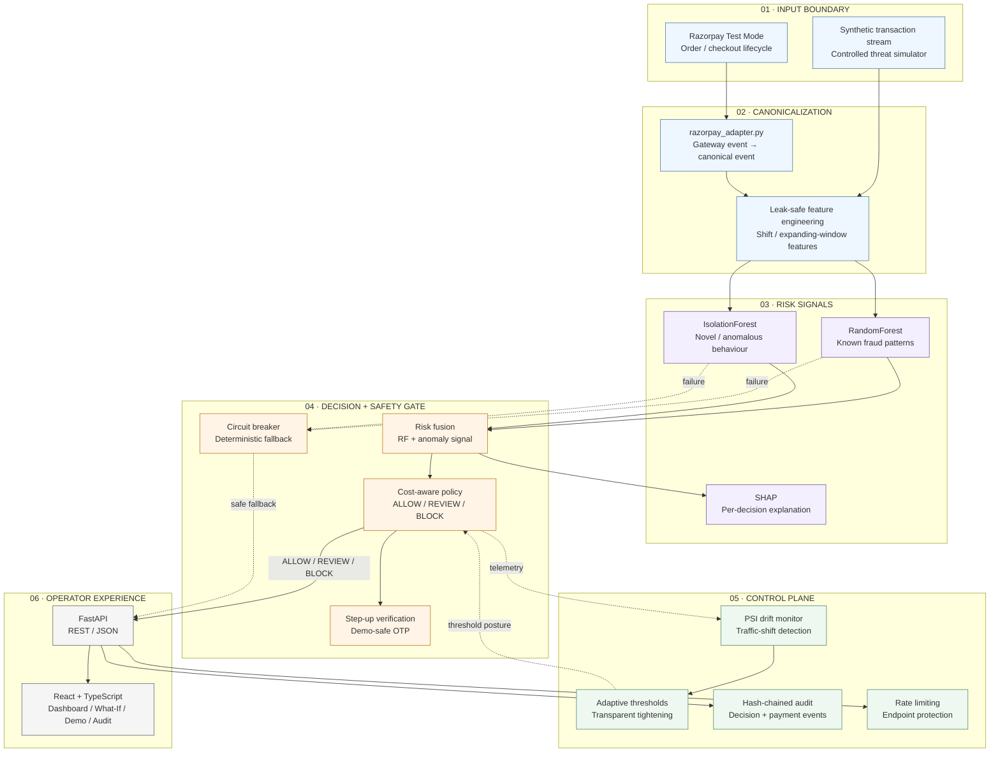
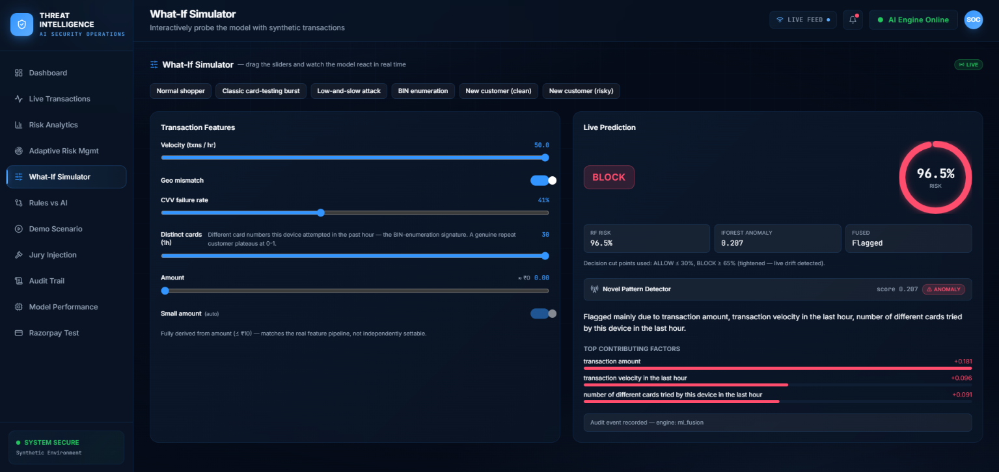
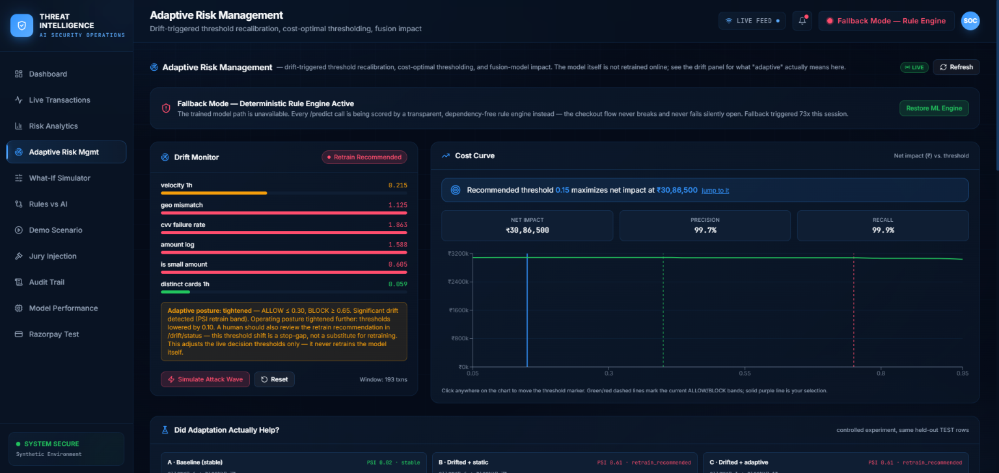
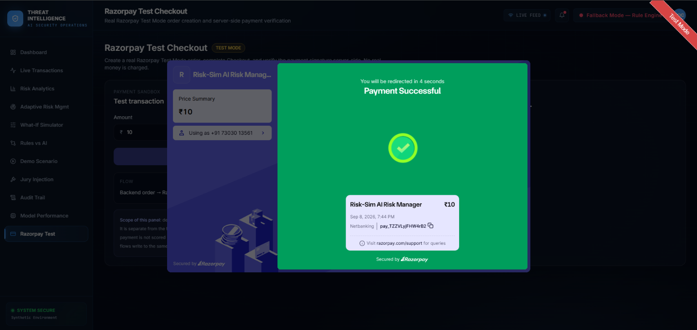
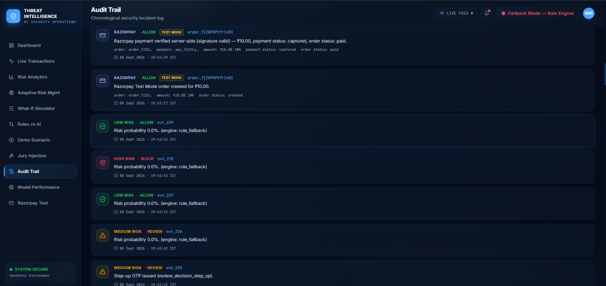
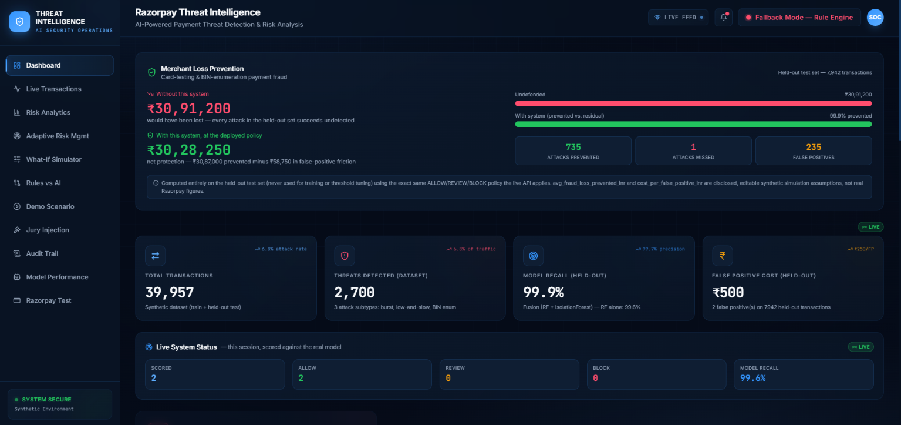
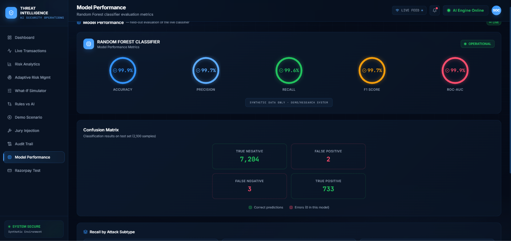

# risk-sim — Explainable Real-Time Fraud Risk Engine

**A production-style fraud detection system that combines supervised ML, unsupervised anomaly detection, drift monitoring, and per-decision explainability — built to show not just *that* a transaction is risky, but *why*.**

[](https://risk-sim.vercel.app/)
[](https://risk-sim-xqou.onrender.com/health)
[](#tech-stack)
[](#tech-stack)
[](#tech-stack)
[
(https://github.com/gokul-dev47/risk-sim/actions/workflows/ci.yml)
[](#license)

🔗 **Live App:** [risk-sim.vercel.app](https://risk-sim.vercel.app/)  
🔗 **Backend Health Check:** [risk-sim-xqou.onrender.com/health](https://risk-sim-xqou.onrender.com/health)

> ⚠️ The backend is hosted on Render's free tier and may take 30–60 seconds to spin up on first request after inactivity.

---

## 🎬 Try the Demo — Start Here

The fastest way to evaluate the system is the deployed application — no local setup required.

**Live App:** https://risk-sim.vercel.app/  
**Backend Health:** https://risk-sim-xqou.onrender.com/health  
**Demo Video:** https://youtu.be/sfBqxrUBPX4

### 90-second judge path

1. Open the **Live App**.
2. If the Render backend is cold, open **Backend Health**, wait ~30–60 seconds, then refresh.
3. Open **What-If Simulator** and submit a transaction to see the live decision, RF signal, IsolationForest anomaly signal, fusion state, and SHAP contributors.
4. Open **Demo Scenario** and run the deterministic attack progression to see the drift monitor respond to repeated traffic.
5. Open **Adaptive Risk Management** to inspect drift, cost-aware thresholds, model comparison, and the controlled A/B/C experiment.
6. Open **Razorpay Test** to complete a Razorpay Test Mode checkout and inspect server-side verification.
7. Open **Audit Trail** to see both risk-system events and the Razorpay Test Mode payment lifecycle recorded in the same tamper-evident audit stream.

> **Important demo boundary:** Razorpay is used in **Test Mode only**. The showcased Razorpay checkout is a sandbox payment/order lifecycle and server-side signature-verification demonstration; it does not process production payments or real card data.

---

## 🧭 Why This Fits a Payment-Risk System

| Risk-system requirement | How `risk-sim` addresses it |
|---|---|
| **Detect risk** | RandomForest detects learned fraud patterns; IsolationForest adds an independent anomaly signal. |
| **Explain decisions** | Live risk predictions expose SHAP-based feature contributions. |
| **Control false positives** | Thresholds are evaluated with an explicit fraud-vs-decline cost function. |
| **Handle changing traffic** | PSI-based drift monitoring can tighten decision thresholds when traffic shifts. |
| **Fail safely** | A circuit breaker switches to a deterministic fallback rule engine when the ML path is unavailable. |
| **Remain auditable** | Decisions, OTP events, rate-limit events, and payment lifecycle events are recorded in a tamper-evident hash chain. |
| **Integrate with payments safely** | Razorpay Test Mode demonstrates order creation, checkout, server-side signature verification, and audit integration without production payment access. |
| **Prove rather than claim** | The deployed API, UI demonstrations, CI pipeline, diagnostics, drift experiments, and resilience paths are directly inspectable. |

---

## 📌 Overview

`risk-sim` is a full-stack fraud-risk engine built around one core idea: **fraud detection systems shouldn't just be accurate — they should be explainable, auditable, and honest about their own limitations.**

A FastAPI backend turns raw transaction data into leak-safe engineered features, scores them through a **fused RandomForest + IsolationForest pipeline**, and returns a model-derived risk score with a **SHAP-based, per-transaction explanation**. (Calibration — Brier score and Platt-scaling comparison — is analyzed separately in `/model/diagnostics` and `MODEL_CARD.md`, but the live decision path serves the raw model score, not a calibrated one; see Honest Metrics below.) A React + TypeScript dashboard visualizes live scoring, drift status, audit trails, and "what-if" simulations for demo and review purposes.

The project is designed to answer a realistic fraud-risk brief: *catch both known and novel payment fraud patterns while keeping every decision explainable, auditable, and resilient to failure.*

---

## ✨ Key Features

- **Hybrid Detection** — A `RandomForestClassifier` catches known fraud patterns; an `IsolationForest` flags statistically unusual behavior the classifier has never seen labeled examples of. Their outputs are fused into a single `ALLOW / REVIEW / BLOCK` decision.
- **Explainable AI** — Every `/predict` response includes a real, SHAP-computed explanation showing which features contributed most to the model's risk score for that specific transaction — not a canned or templated explanation.
- **Cost-Aware Decisioning** — Decision thresholds are chosen by minimizing an explicit cost function that weighs missed fraud against false declines (`/model/cost-curve`).
- **Drift Monitoring & Adaptive Thresholds** — A PSI-based drift monitor tracks live traffic against the training distribution and automatically (and transparently) tightens ALLOW/BLOCK thresholds when drift increases — with a disclosed A/B/C experiment proving out its actual effect.
- **Resilience by Design** — A circuit breaker falls back to a deterministic rule engine if the ML pipeline fails, instead of crashing or silently allowing every transaction through. Failure can be demoed live and reversed on demand.
- **Tamper-Evident Audit Trail** — A hash-chained audit log (à la git commits) records every prediction, OTP event, and rate-limit trip, with integrity verification exposed via API.
- **Honest-by-Design Frontend** — The UI never fabricates data when the backend is unreachable; it shows an explicit "Risk Engine Unavailable" state instead of a fake score. All illustrative/static figures are clearly labeled as such.
- **Step-Up Verification & Rate Limiting** — Borderline transactions can trigger a demo-safe OTP challenge; all sensitive endpoints are protected by per-endpoint rate limiting.
- **Real-World Benchmark** — Includes a separate model trained and evaluated on the public **IEEE-CIS Fraud Detection** dataset, kept isolated from the live synthetic-data pipeline for methodological honesty.

---

## 🏗️ Architecture — Risk, Safety & Payment Boundaries

The system is deliberately organized around **trust boundaries**, not just a generic data-flow diagram. Payment events enter through a controlled adapter; ML produces signals; deterministic policy makes the decision; drift, fallback, rate limiting, and audit operate as safety/control layers.



### Trust boundaries

| Boundary | Rule |
|---|---|
| **Razorpay → Adapter** | External payment events are normalized; they do not directly set a fraud decision. |
| **ML → Decision Gate** | Model signals feed deterministic decision policy; an anomaly flag alone does not auto-block. |
| **Decision → Fallback** | ML failure switches to a deterministic fallback rather than silently allowing transactions. |
| **Decision → Audit** | Risk events are written to a hash chain for later integrity verification. |
| **Drift → Thresholds** | Drift can change decision thresholds; it does not silently retrain the model. |
| **Frontend → Backend** | The UI does not fabricate a risk result when the backend is unavailable. |

---

## 🧠 How Detection Works

| Model | Question it answers |
|---|---|
| **RandomForest** | "Does this look like a known kind of fraud we've seen labeled examples of?" |
| **IsolationForest** | "Does this look statistically unlike normal behavior at all — known or not?" |

Fusing both signals broadens coverage across known and novel attack patterns while keeping the final decision behind explicit thresholds. Importantly, an anomaly flag alone never auto-blocks a transaction — novel-but-uncertain behavior is escalated to `REVIEW` for human review, not unilaterally blocked.

---

## 💳 Razorpay Test Mode Integration

Razorpay is treated as a **sandboxed payment-system boundary** around the risk platform.

The deployed **Razorpay Test** panel demonstrates a real Razorpay Test Mode order → Checkout → payment-signature → server-side verification lifecycle, with the resulting payment events written to the application's audit trail.

### What the integration demonstrates

- **Test Mode order creation** — the backend creates a Razorpay Test Mode order for the checkout flow.
- **Hosted checkout** — the user completes the payment in Razorpay's Test Mode checkout.
- **Server-side verification** — the backend verifies the returned payment signature and exposes the verified payment/order status.
- **Audit integration** — order creation and verified payment events are recorded in the same audit stream as risk-system events, distinguished by event type.
- **Optional SDK boundary** — Razorpay-specific functionality is isolated so the core risk engine does not depend on production gateway credentials.
- **Canonical event adapter** — `risk_engine/razorpay_adapter.py` provides the gateway-event → `CanonicalTransactionEvent` mapping used for payment-event integration.

### What it deliberately does **not** claim

- The showcased Razorpay checkout is **not a production payment integration**.
- No production Razorpay credentials are used.
- No real-money payment is processed.
- No real card data is stored or transmitted by this project.
- The Razorpay Test checkout panel is intentionally separate from the fraud-model scoring views; the UI explicitly labels the payment flow as a payment/order verification demonstration.

> **Why this matters:** the project shows a credible payment-gateway integration boundary without pretending that a hackathon sandbox is a production acquiring or fraud-decision system.

---

## 🖼️ Product Walkthrough

These screenshots show the main evaluation surfaces of the deployed system: **live fraud-risk scoring, explainability, adaptive risk management, payment integration, auditability, and model performance**.

### Live Risk Decision + Explainability



The What-If Simulator exposes the live decision surface: **RandomForest risk, IsolationForest anomaly score, fused decision, and the top contributing SHAP features** for an individual transaction.

### Adaptive Risk Management + Drift Response



The Adaptive Risk Management view connects **PSI-based drift detection, cost-aware thresholding, precision/recall trade-offs, and adaptive decision posture**. The interface also makes clear that drift recommends retraining rather than silently retraining the model.

### Razorpay Test Mode — Successful Checkout



A real **Razorpay Test Mode** checkout is completed successfully using a sandbox transaction. No production payment credentials or real-money transactions are involved.

### Audit Trail



The audit trail records **Razorpay Test Mode payment events alongside fraud-risk decisions**, providing an inspectable chronological security event history.

### Dashboard — Merchant Loss Prevention



The main dashboard summarizes the system's **held-out evaluation results, attack prevention, false positives, model recall, and estimated merchant-loss impact** under the deployed decision policy.

### Model Performance



The Model Performance view exposes the RandomForest evaluation metrics and confusion matrix, including **accuracy, precision, recall, F1 score, ROC-AUC, true positives, false positives, and false negatives**.

> **Note:** All transaction data and monetary impact figures shown in the dashboard are based on the project's synthetic dataset and disclosed simulation assumptions. Razorpay screenshots are from Test Mode only.

## 📊 Results at a Glance

| Metric | Value | Notes |
|---|---|---|
| ROC-AUC | Live endpoint | Current value is served by `/model/metrics` from the deployed model artifact |
| AUC-PR (Average Precision) | Reported alongside ROC-AUC | More honest metric on imbalanced fraud data |
| Fusion precision | 0.758 | Deliberate tradeoff — favors catching more fraud over fewer false positives |
| Weakest fraud subtype | `bin_enumeration` — 97.9% recall | Disclosed as a known limitation, not hidden |
| Brier score (calibration) | 0.00059 | Already well-calibrated on this dataset; Platt scaling gave no measurable improvement |
| Adaptive thresholding effect (A/B/C test) | ~0.1% cost change | Honest null result — reclassified individual transactions but didn't move recall |
| Canonical event feature parity | 392/393 rows (99.7%) match offline pipeline | One disclosed same-timestamp edge case |

*(The live deployment exposes current model metrics through `/model/metrics`, diagnostics through `/model/diagnostics`, and adaptive-threshold evaluation through `/model/adaptive-effectiveness`. The README avoids presenting a stale ROC-AUC value as current.)*

---

## 🛠️ Tech Stack

| Layer | Technologies |
|---|---|
| **Backend** | Python 3.12, FastAPI, uvicorn, scikit-learn (RandomForest, IsolationForest), SHAP, pandas, numpy |
| **Frontend** | React, TypeScript, Vite, Tailwind CSS, lucide-react |
| **Testing** | pytest, httpx (FastAPI `TestClient`) |
| **CI/CD** | GitHub Actions (backend pytest + frontend `tsc --noEmit` build) |
| **Containerization** | Docker (multi-stage frontend build via nginx), Docker Compose |
| **Deployment** | Vercel (frontend), Render (backend) |

---

## 📂 Repository Structure

```text
risk-sim/
├── backend/
│   └── main.py                  FastAPI app: /predict, /model/*, /drift/*, /audit/*, /system/*
├── risk_engine/
│   ├── feature_engineering.py   Leak-safe feature construction
│   ├── train_model.py           RandomForest + IsolationForest training
│   ├── explainability.py        SHAP-based per-decision explanations
│   ├── drift_monitor.py         PSI-based concept drift detection
│   ├── adaptive_thresholds.py   Drift-triggered threshold recalibration
│   ├── baseline_model.py        Rule-based fallback / comparison engine
│   ├── audit_chain.py           Hash-chained tamper-evident audit log
│   └── ...                      Additional analysis & resilience modules
├── simulator/
│   └── generate_threat_data.py  Synthetic transaction generator
├── data/                        Raw + processed data, trained model artifacts
├── frontend/
│   └── src/
│       ├── views/                Dashboard, Live Transactions, What-If Simulator,
│       │                         Model Performance, Audit Trail, Demo Scenario
│       ├── components/           Shared UI components
│       └── services/api.ts       Backend client
├── tests/                        pytest suite
├── .github/workflows/ci.yml      CI pipeline (backend + frontend)
├── Dockerfile / docker-compose.yml
├── run_pipeline.py               One-command: generate → engineer → train → diagnose
├── MODEL_CARD.md                 Intended use, performance, known limitations
└── README.md
```

---

## 🚀 Getting Started

### Option 1 — Docker (recommended, no local Python/Node needed)

```bash
git clone https://github.com/gokul-dev47/risk-sim.git
cd risk-sim
docker compose up --build
```

- Backend API → `http://localhost:8000` (`/health` for a liveness check)
- Frontend → `http://localhost:5173`

### Option 2 — Manual Setup

```bash
# Clone
git clone https://github.com/gokul-dev47/risk-sim.git
cd risk-sim

# Backend
pip install -r requirements.txt
python3 run_pipeline.py                       # generate data + train models
python3 -m uvicorn backend.main:app --reload  # start API

# Frontend (in a separate terminal)
cd frontend
npm install
npm run dev
```

### Run Tests

```bash
pytest tests/
```

---

## 🌐 Live Deployment

| Service | URL |
|---|---|
| **Frontend Dashboard** | [risk-sim.vercel.app](https://risk-sim.vercel.app/) |
| **Backend Health Check** | [risk-sim-xqou.onrender.com/health](https://risk-sim-xqou.onrender.com/health) |

---

## 🔌 Key API Endpoints

| Endpoint | Purpose |
|---|---|
| `GET /health` | Liveness / readiness check |
| `POST /predict` | Score a single transaction, return decision + explanation |
| `POST /api/v1/simulate-attack` | Live transaction injection through the same scoring pipeline |
| `GET /model/metrics` | Accuracy, precision, recall, confusion matrix |
| `GET /model/cost-curve` | Cost-aware threshold curve |
| `GET /drift/status` | Current drift status (PSI-based) |
| `GET /audit/recent` | Recent decisions for audit / review |
| `GET /model/diagnostics` | Calibration, fairness proxy, latency |
| `GET /system/status` | Circuit breaker state |
| `GET /razorpay/status` | Razorpay SDK / integration readiness |
| `POST /razorpay/order` | Create a Razorpay Test Mode order |
| `POST /razorpay/verify` | Verify Razorpay payment signature |

*(Full endpoint list available in the source code and API docs at `/docs` when running locally.)*

---

## 📊 Honest Metrics & Model Card

This project deliberately reports metrics most demo projects skip:

- **AUC-PR (Average Precision)** alongside ROC-AUC, since ROC-AUC can look misleadingly strong on imbalanced fraud data.
- **Calibration analysis** (Brier score + Platt scaling comparison).
- A disclosed **A/B/C experiment** measuring whether adaptive thresholding actually improves outcomes — reported honestly, including a null/marginal result.
- Reports the RandomForest's Brier score (0.00059 — already well-calibrated on this dataset)

See [`MODEL_CARD.md`](./MODEL_CARD.md) for full intended-use documentation, performance breakdowns, and known limitations.

### Reliability & resilience evidence

- `risk_engine/load_test.py` exercises the real `/predict` path across increasing concurrency levels.

> **Note on load-test data:** `data/processed/load_test_results.json` is a
> committed snapshot from a real run of `risk_engine/load_test.py` against
> this trained model — not hand-written or fabricated. It is not
> regenerated on every container boot (see `Dockerfile`) because
> Render's free-tier shared CPU made the live background job too slow
> and inconsistent to be reliably ready by the time a judge opens the
> dashboard. Anyone can reproduce it independently by running
> `python3 risk_engine/load_test.py` themselves against a running
> instance — the numbers are real `/predict` latencies against the real
> `ml_fusion` engine, just captured once rather than re-run on every
> cold start.

- The test suite covers API behaviour, model diagnostics, drift behaviour, and resilience/fallback paths.
- GitHub Actions runs the backend pipeline/tests and the frontend type-check/build on every CI run.
- The test suite covers API behaviour, model diagnostics, drift behaviour, and resilience/fallback paths.
- GitHub Actions runs the backend pipeline/tests and the frontend type-check/build on every CI run.

---

## 🔍 Reviewer Verification Matrix

A reviewer can verify the core claims directly instead of relying on screenshots:

| Claim | Where to verify |
|---|---|
| Backend is healthy | `/health` |
| Model artifacts are loaded | `/health`, `/model/metrics` |
| Risk decisions are live | `/predict` / **What-If Simulator** |
| Explanations are model-generated | `/predict` response + SHAP panel |
| Drift is measurable | `/drift/status` + **Demo Scenario** |
| Threshold adaptation is explicit | `/model/adaptive-effectiveness` + **Adaptive Risk Management** |
| Failure recovery exists | Circuit-breaker state + **Fallback Mode** |
| Razorpay Test checkout works | **Razorpay Test** panel |
| Payment verification is server-side | Razorpay verification result |
| Payment events are auditable | **Audit Trail** |
| CI is enforced | `.github/workflows/ci.yml` |

---

## ⚠️ Limitations

- The `bin_enumeration` is the weakest-detected fraud subtype, at 97.9% recall.
- Fusion precision sits at 0.758 — favors catching more fraud at the cost of a higher false-positive rate, a deliberate but debatable tradeoff.
- The graph-based identity-clustering feature is a standalone ablation study and is **not yet wired into the live model**.
- Drift monitoring recommends retraining but does not perform it automatically; it does automatically (and transparently) tighten decision thresholds.

---

## 🧯 What Broke, and How I Found It

Shipping isn't the same as running. These are real production-shaped bugs found after deployment, not hypotheticals — each one caught by actually exercising the system, not by re-reading the code.

**1. CI passed locally but failed on a fresh clone.**
`/model/load-test` depended on a specific script run-order that only existed inside the Docker entrypoint. A bare `pytest tests/` — the first thing any reviewer runs — never triggered that script, so the test suite failed 100% of the time outside Docker. Root cause: a hidden dependency on execution environment, not on the test itself. Fixed by making the test suite self-sufficient (`tests/conftest.py` generates the missing artifact in an isolated subprocess, so no test's shared in-memory state — the audit chain, the rate limiter — gets polluted by traffic the fixture itself generates).

**2. The Docker image couldn't run its own test suite.**
The `Dockerfile` never copied `tests/` into the image at all — `pytest tests/` inside the container failed with "file or directory not found." Cosmetic-looking, but it meant the exact claim "run the tests yourself" silently didn't work in the one environment (Docker) the README recommends first.

**3. Two tables in this same README disagreed with each other.**
"Results at a Glance" reported stale metrics (0.599 fusion precision, 94.7% recall) left over from an earlier training run; "Limitations," further down, had the current, correct numbers (0.758, 97.9%) from a retrain that happened later. Caught by re-running the pipeline and diffing the actual `model_metrics.json` against every number printed in the README — not by re-reading the prose, which read fine either way.

**4. The live deployment was stuck in fallback mode after a demo test.**
The circuit-breaker "Simulate ML Outage" control (built to demo graceful degradation live) had been triggered and never restored, so every `/predict` call was silently being scored by the rule-engine fallback, not the trained model — while the health check still reported `model_loaded: true`, because model loading and circuit-breaker state are genuinely independent flags. Confirmed via `/system/status` directly, fixed via the "Restore ML Engine" button that already existed in the UI.

**5. The load-test panel raced Render's cold start, indefinitely.**
`risk_engine/load_test.py` ran in the background after `uvicorn` started, polling `/health` first — reasonable locally, but Render's free-tier shared CPU meant it could take several minutes to finish, and the frontend gave up long before that. A retry-window increase helped but didn't fully close the gap. The actual fix: the script calls the FastAPI app in-process via `httpx.ASGITransport` (no live server needed), so it can run at **build time**, baked into the image alongside model training — removing the runtime race condition entirely instead of tuning around it.

None of these were caught by writing more code — they were caught by actually running the thing: cloning fresh, hitting the live URLs, reading `/system/status` directly, and cross-checking every number in this README against the artifact that actually produced it.


---

## 🗺️ Roadmap

- [ ] Improve `bin_enumeration` recall via additional BIN-level aggregation features
- [ ] Integrate the graph-based feature into the live model, pending further validation
- [ ] Add human-approved automated retraining *proposals* triggered by drift status
- [ ] Expand the synthetic dataset with more fraud subtypes and seasonal patterns

---

## 🔒 Data & Safety Disclaimer

All transaction data, card numbers, and cost assumptions used in this project are **synthetically generated** for demonstration purposes. This project uses no real card numbers or user data, has no live integration with any production payment system, and is intended strictly as a defensive risk-detection prototype.

---

## 👤 Author

**Gokul** — [GitHub](https://github.com/gokul-dev47)

---

## 📄 License

This project is licensed under the MIT License.
